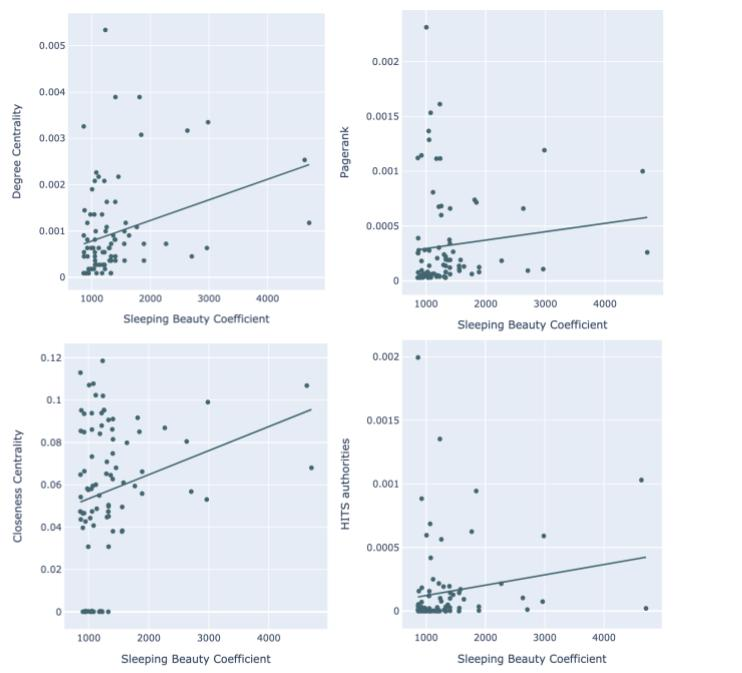
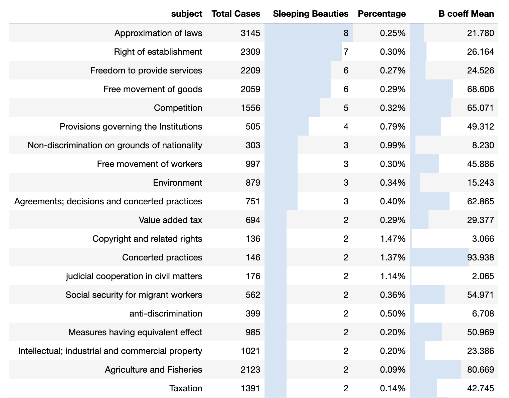
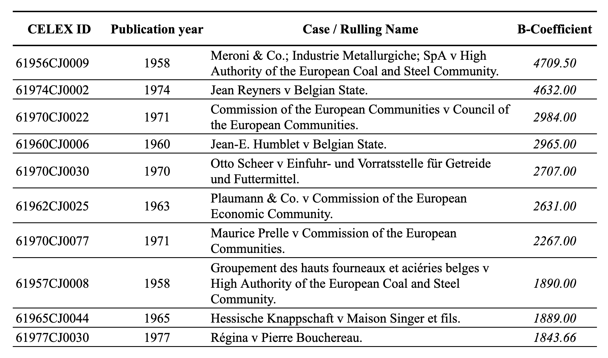

[](https://www.gnu.org/licenses/old-licenses/lgpl-2.1.en.html)

# Sleeping Beauties in Case Law

This repository contains the code to reproduce the computational study from the [paper](https://cris.maastrichtuniversity.nl/en/publications/sleeping-beauties-in-case-law) by [Pedro Hernández Serrano](https://cris.maastrichtuniversity.nl/en/persons/pedro-hern%C3%A1ndez-serrano), [Kody Moodley](https://cris.maastrichtuniversity.nl/en/persons/kody-moodley), [Gijs van Dijck](https://cris.maastrichtuniversity.nl/en/persons/gijs-van-dijck), and [Michel Dumontier](https://cris.maastrichtuniversity.nl/en/persons/michel-dumontier)

One of the challenges in computational legal research is trying to quantitatively assess “relevance” in a network of court decisions. In Scientometrics, the phenomena of “delayed recognition” for scientific publications has been studied. In this connection, the term "sleeping beauty" (SB) was coined to denote an article that received almost no attention immediately after publication, but suddenly receives a burst of citations many years later, these publications can be identified by calculating their so-called Beauty coefficient (B-coefficient). In this contribution, we apply approaches used for identifying SBs to the context of European case law, more specifically to decisions arising from the Court of Justice of the European Union (CJEU). We compared B-coefficients of CJEU cases with their centrality scores using classical algorithms from network analysis, finding that these measures tend to correlate. This makes the B-coefficient a potential candidate for an additional measure of case relevance or significance. We discuss the implications of this that are interesting for legal scholars, acknowledging that future work is required to calibrate the scale of the time variable in the B-coefficient formula for finer-grained application to case law. The setup of our study provides a template and foundation for a set of methodologies for case law analytics that extends the power of traditional network analysis techniques for answering questions about the behavior of European court systems.





## Citation

For attribution in academic contexts, please cite this work as:

```latex
@inproceedings{serrano2020sleeping,
  title = {Sleeping Beauties in Case Law},
  author = {{Hern{\'a}ndez Serrano}, Pedro and Kody Moodley and {van Dijck}, Gijs and Michel Dumontier},
  booktitle = {International Conference on Legal Knowledge and Information Systems, JURIX},
  month = dec,
  year = {2020},
  address = {Prague, Czech Republic}
}
```

## FAIR Research Data Management

### Findable
- **Data Archiving**: Findable data can be indexed in public repositories, making it Accessible
<!-- Dataverse, Zenodo -->
- **Data Reusing**: Reusable data must be uniquly referenced, making it Findable. 
<!-- cite paper, cite data, cite software, adding the persistent identifier-->

### Accessible
- **Data Access Protocols**: Interoperable data can be retrieved with an open protocol, making it Accesible
<!-- Link to access protocols, including open access -->
- **Terms of Use (for machines)**: Accessible data contains machine friendly terms of use, making it Reusable.
<!-- Link to terms of use -->

### Interoperable
- **Rich Metadata**: Interoperable metadata is semantically described with ontology terms (e.g. Dublin Core), making it Findable.
<!-- Link to terms of use -->
- **Data Descriptions (for machines)**: Interoperable data is adequately described, machine friendly, making it Reusable
<!-- Link to the rdf file -->

### Reusable
- **Terms of Use (for humans)**: Accessible data contains human friendly terms of use, making it Reusable.
<!-- Link to terms of use, Licence -->
- **Data Descriptions (for humans)**: Interoperable data is adequately described, human friendly, making it Reusable 
<!-- Link to codebook -->


## License

This repository is licensed under the terms of the [LGPL-2.1](https://www.gnu.org/licenses/old-licenses/lgpl-2.1.en.html) license.
